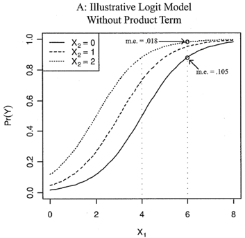

Este documento utilizará la base de datos de Duanmu, J.L., & Urdinez, F. (2017): The dissuasive effect of US political influence on Chinese FDI during the "Going Global" policy era. Business and Politics, 1-32, para realizar análisis descriptivos e inferenciales. Los autores utilizan datos a nivel país, a nivel empresa y las diadas empresa-país para testear si las inversiones chinas están condicionadas por variables de política internacional.

Antes de comenzar, cargamos los paquetes correspondientes:

```{r}
library(pacman)
p_load (haven, sjPlot, tidyverse, VGAM, stargazer, separationplot, MASS, AER, pscl, janitor, stringr, dplyr, mosaic, foreign, censReg)
```

Luego abrimos la base de datos:

```{r}
data <- read.csv("country_level.csv")
```

Ahora corregimos los nombres:

```{r}
data_modif <- data %>%
  rename(year = YEAR, num = NUM, ofdi = OFDI, gdppc = GdpPc, dist_china = dist_CHINA, chinesexunga_imp = chineseXunga_imp, chinesexmilaidpc = chineseXmilaidpc, chinesexecoaidpc = chineseXecoaidpc, usainvxunga_imp = usainvXunga_imp, usainvxecoaidpc = usainvXecoaidpc, usainvxmilaidpc = usainvXmilaidpc, soes = SOEs, poes = POEs, ungaxsoe = ungaXsoe, ecoaidxsoe = ecoaidXsoe, milaidxsoe = milaidXsoe, usainvxdiaspora = usainvXdiaspora, usainvxsoe = usainvXsoe, indexxdiaspora = indexXdiaspora, index_1 = INDEX, min_index = min_INDEX, max_index = max_INDEX, x_est_soe = X_est_soe)
```

Todos los nombres de las variables que incluian mayúsculas fueron pasados a minúsculas. Se creó una nueva base con estas modificaciones llamada data_modif.

Al importar datos en formato CSV las variables categóricas deben ser formateadas para que R las lea como factores.

Para traspasar las variables categóricas utilizamos el siguiente código. En este caso, las variables que tenemos que transformar son tres: country, region y country1:

```{r}
data_modif$country <- as.factor(data_modif$country)
data_modif$region <- as.factor(data_modif$region)
data_modif$country1 <- as.factor(data_modif$country1)
```

Comenzaremos con un análisis descriptivo. La base cubre 137 países y 8 años (del 2005 al 2012). Esto lo podemos comprobar mediante un vistazo rápido de las variables "country" y "year", a partir del siguiente comando:

```{r}
data_modif %>%
  tabyl(country)

data_modif %>%
  tabyl(year)
```

Primero veremos a nivel general, el promedio de inversión china por país, tomando en cuenta los datos de todos los años de la base de datos:

```{r}
aggregate (sum ~ country, data = data_modif, FUN = "mean")
```

Luego vemos el promedio de inversión china por año:

```{r}
aggregate (sum ~ year, data = data_modif, FUN = "mean")
```

Por último, podemos hacer una tabla que nos muestre el promedio de nivel de inversión china en cada país y para cada año:

```{r}
aggregate (sum ~ country + year, data = data_modif, FUN = "mean")
```

A nivel de proyectos, los datos muestran que la región que recibió el mayor número de proyectos corresponde a la región del Sudeste Asiático (SE Asia) con 167 proyectos de inversión. Antes, haremos unos ajustes para que la variable "rcode" nos muestre las etiquetas de las regiones y no solo los números.

```{r}
data_modif$rcode <- factor( data_modif$rcode,
                   levels = c( 1, 2, 3, 4, 5, 6, 7, 8),
                   labels = c( "Latin America", "North America", "Oceania", "Europe", "SSA", "Arab World", "Russia and ex USSR", "SE Asia")
                  )
```


```{r}
aggregate (num ~ rcode, data = data_modif, FUN = "sum")
```

En relación a los montos, como se observa a continuación la region que recibió más monto de inversión total es también la región correspondiente al Sudeste asiático (SE Asia), donde la suma de inversiones desde el año 2005 al 2012 asciende a US107.390.

```{r}
aggregate (sum ~ rcode, data = data_modif, FUN = "sum")
```

Hacemos un gráfico de los montos de inversiones chinas por región.

```{r warning=F}
ggplot (data = data_modif,
        aes(x = factor(rcode), y=sum)) +
  ylab(label = "Montos de inversion totales") +
  xlab("Regiones") +
  coord_flip() +
  theme (text = element_text(size=10)) +
  stat_summary(fun.y = "sum", geom = "bar")
```

Crearemos una variable que sea la media de proyectos por región al que el país pertenece. Para crear una nueva variable que contenga la media de proyectos por region utilizaremos el siguiente comando:

```{r}
data_modif$proy_region <- ave(data_modif$num, data_modif$rcode)

data_modif %>%
  tabyl(proy_region)
```

Ahora crearemos una variable que sea el porcentaje que representa cada país en la cantidad de proyectos recibidos por región. Primero crearemos una nueva variable "paisesxregion" que contenga el número de países por cada región. El número de países lo obtenemos rapidamente tabulando la variable rcode y poniendo atención al "n":

```{r}
data_modif %>%
  tabyl(rcode)
```

Ahora generamos la variable

```{r}
data_modif <- data_modif %>%
  mutate(paisesxregion = case_when(
    rcode %in% c("Latin America") ~ "112",
    rcode %in% c("North America") ~ "16",
    rcode %in% c("Oceania") ~ "16",
    rcode %in% c("Europe") ~ "168",
    rcode %in% c("SSA") ~ "176",
    rcode %in% c("Arab World") ~ "72",
    rcode %in% c("Russia and ex USSR") ~ "48",
    rcode %in% c("SE Asia") ~ "104"
  ))
```

Nos aseguramos que las variables sean númericas, para así poder hacer las operaciones matemáticas

```{r}
data_modif$paisesxregion <- as.numeric(data_modif$paisesxregion)
data_modif$num <- as.numeric(data_modif$num)
```

Por último creamos la variable porc_paisxreg que representará el porcentaje de cada país en los proyectos recibidos por región. La variable la creamos simplemente multiplicando la variable "num" x 100 y diviendo por la variable que acabamos de crear (paisesxregion)

```{r eval = F}
mutate(data_modif, porc_paisxreg = num * 100 / paisesxregion)
```

Haremos un gráfico scatter en el que el eje vertical tiene la cantidad de inversiones chinas en US$ y en el eje horizontal la proximidad en votos en la AGNU con los EEUU.

```{r warning=F}
ggplot (data = data_modif,
        aes(x = unga_imp, y=sum)) +
  ylab(label = "Montos de inversion China") +
  xlab("Convergencia de votos con EEUU") +
  theme (text = element_text(size=12)) +
  geom_smooth(method = "lm", level = 0.95, col="red") +
  geom_point()
```

Como se observa, a primera vista no pareciera haber una relación lo suficientemente clara entre los montos de inversión China y la convergencia de votos con Estados Unidos. Incluso, a partir del gráfico se observa que en aquellos países que han recibido mayores montos de inversión (Canadá, Australia y Brasil), que son los puntos que se encuentran de la mitad hacia arriba de la gráfica, la convergencia de votos con Estados Unidos es bastante diversa. Canadá tiene una convergencia de 85.7, mientras que Australia de 56.9 y Brasil de 34.3.

Ahora utilizaremos como variable dependiente la cantidad de proyectos de inversión de empresas chinas.

La variable dependiente en este caso corresponde a "num" mientras que como variable independiente de interés utilizaremos "unga_imp". Por lo anterior, como nuestra variable dependiente es de conteo, correremos un modelo primeramente con Poisson, debido a que estimar este modelo de otra forma (con OLS por ejemplo), nos entregaría estimadores ineficientes e inconsistentes. Al modelo le hemos agregado además otras seis variables que podrían ser también relevantes:

```{r}
modelo_poisson <- glm(num ~ unga_imp + ecoaid + gdp + population + dist_china + diaspora + inflation,
                      family = "poisson",
                      data = data_modif)

stargazer(modelo_poisson,
                      type    = "text",
                      report  = "vc*p",
                      title   = "Modelo Poisson"
                      )
```

```{r eval = F}
stargazer(modelo_poisson,
                      type   = "html",
                      out    = "modelo_poisson.html",
                      report = "vc*p",
                      title  = "Modelo Poisson")
```

Como se observa, la variable de interés unga_imp no resulta significativa, mientras que las variables de "ayuda económica de los EEUU", "Producto Interno Bruto", "Población", "% de Chinos viviendo en el país" e "Inflación" resultan significativas al 0.01.

Como a partir de lo anterior no podemos hacer muchas afirmaciones respecto de la magnitud de los efectos encontrados, ahora debemos exponenciar los coeficientes para hacer el análisis de los mismos a través de los Incident Rate Ratios, junto con los intervalos de confianza:

```{r warning = F}
exp(coef(modelo_poisson))
exp(confint(modelo_poisson))
```

Y graficamos:

```{r warning = F}
sjp.glm(modelo_poisson, 
        show.ci     = T,
        title       = "Modelo de Poisson, Incident Rate Ratios")
```

A partir del gráfico anterior, se deduce que la tasa de incidencia respecto de los chinos viviendo en el país aumenta la inversión China en ese país en un factor de 3.54, manteniendo las otras variables constantes. A partir de esto, también se deduce que a pesar de las otras variables ser significativas (menos dist_china), el efecto de éstas no pareciera ser sustantivo, ya que están muy cercanos a 1: esto significaría que no existe relación o es muy pequeña.

Ahora analizaremos la distribución de la variable dependiente y decidiremos el mejor método para estimar nuestro modelo.

Primero daremos un vistazo rápido al histograma de la variable dependiente:

```{r}
hist(data_modif$num)
```

Como se observa, hay una concentración bastante grande de valores que van del 0 al 2, lo que luego se va diluyendo paulatinamente.

Uno de los supuestos detrás de la distribución de Poisson es que la media es igual a la varianza, pero en la realidad esto no siempre es así. Haremos un test de sobredispersión para determinar si tenemos una varianza mayor a la media.

```{r}
dispersiontest(modelo_poisson, trafo = 1)
```

Para que se cumpla el supuesto de equidispersión el test debería dar 0, sin embargo da 0.9393: hay algo de sobredispersión. Ahora haremos el test de Vuong comparando primero el modelo de Poisson con el de Zero Inflated y luego uno de NegBin con Zero Inflated para determinar si la variable dependiente tiene un problema de ceros inflados.

```{r warning = F}
modelo_negbin <- glm.nb(num ~ unga_imp + ecoaid + gdp + population + dist_china + diaspora + inflation,
                        data = data_modif)

summary (modelo_negbin)

modelo_zeroinfl <- zeroinfl(num ~ unga_imp + ecoaid + gdp + population + dist_china + diaspora + inflation,
                            dist = c("negbin"),
                            EM = T,
                            data = data_modif)

summary(modelo_zeroinfl)
```

```{r eval = F}
stargazer(modelo_poisson, modelo_negbin, modelo_zeroinfl,
                      type   = "html",
                      out    = "modelo_poisson_negbin_zeroinfl.html",
                      report = "vc*p",
                      title  = "Modelo Poisson - NegBin y Zero Inflated")
```

```{r}
vuong(modelo_poisson, modelo_zeroinfl)
vuong(modelo_negbin, modelo_zeroinfl)
```

Como se observa, los resultados del test de Vuong indican que la estadística de prueba es significativa, por lo cual el modelo de ceros inflados sería en este caso superior al modelo de Poisson estándar y al modelo de NegBin.

Ahora haremos otro ejercicio de estadística inferencial. Esta vez utilizaremos como variable dependiente soe_dummy y probaremos la interacción entre dos variables independientes, a saber, la proximidad en votos en la AGNU con los EEUU y acuerdo bilateral de inversiones en vigor.

Primero correremos el modelo:

```{r}
logit_inter <- glm(soe_dummy ~ unga_imp + bit + unga_imp:bit, 
                           data = data_modif,
                           family = binomial("logit"))
stargazer(logit_inter,
                      type    = "text",
                      report  = "vc*p",
                      title   = "Modelo Logit con variables de interacción"
                      )
```

```{r eval = F}
stargazer(logit_inter,
                      type   = "html",
                      out    = "modelo_logit_inter.html",
                      report = "vc*p",
                      title  = "Modelo Logit con variables de interacción")
```

Ya que tanto la variable dummy como la interactiva son signficativas, entonces tendremos dos lineas de regresión con diferentes interceptos y pendientes. Además, el efecto de la interacción resulta negativo. Ahora graficaremos un separation plot:

```{r}
separationplot(pred    = predict.glm(logit_inter, type = "response"),
               actual  = as.vector(logit_inter$y),
               newplot = F, 
               heading = "Separation plot - Modelo logit con variables interactivas")
```

También veremos un separation plot con bandas:

```{r}
separationplot(pred    = predict.glm(logit_inter, type = "response"),
               actual  = as.vector(logit_inter$y),
               type   = "bands",
               newplot = F, 
               heading = "Separation Plot - Modelo logit con variables interactivas")
```

Como se observa, el modelo parece débil. Si bien se identifican lineas oscuras a la derecha, también es posible identificar muchas a la izquierda por lo que el modelo se equivoca bastante. Esto es razonable si se piensa en la cantidad de variables incluidas en el modelo. Hace sentido pensar que para que el modelo esté bien especificado deberíamos incluir una serie de variables importantes que afectan de igual manera nuestra variable dependiente soe_dummy, y que para este ejemplo no estamos tomando en consideración.

Ahora graficaremos los efectos marginales de nuestra variable interactiva.

```{r}
sjp.int(logit_inter, 
        type        = "eff",
        show.ci     = TRUE,
        axis.labels = c("unga_imp:bit"),
        title       = "Efectos marginales de la variable interactiva unga_imp:bit")
```

El gráfico muestra que cuando la variable unga_imp toma el valor "cero", la pendiente es positiva: si existen tratados bilaterales las probabilidades de que las inversiones de empresas estatales chinas sean al menos del doble de las empresas privadas chinas suben, mientras que si la convergencia de votos toma un valor de 100, la pendiente es negativa: mientras existan más tratados bilaterales las probabilidades de soe_dummy decaen.

Los autores sostienen que la base de datos que utilizan solo incluye los proyectos en los que se invirtieron y aquellos cuyos montos de inversión son superiores a US100 millones, lo que excluye pequeñas inversiones y por tanto el monto de inversión está sesgado. Tomando en cuenta que la solución de los autores me parece la más adecuada para trabajar sus datos (utilizar variable de conteo, Poisson con efectos fijos por país y año), se considera lo siguiente:

1) no podemos correr un modelo logit porque no estamos trabajando con una variable dependiente binaria, sino continua; 2) tampoco sería adecuado un logit ordenado porque no estamos interesados en una variable latente; 3) tampoco sería plausible utilizar multinomial logit debido a que no estamos trabajando con variables categóricas no-ordenadas. Por lo anterior, se proponen dos soluciones:

a. Si pensamos que nuestra variable dependiente parte de US100 millones, podríamos argumentar que nuestra variable está censurada a la izquierda: hay observaciones que podrían tomar valores más bajos a US100 millones, sin embargo esa información no la tenemos. Una opción sería entonces correr el modelo con tobit:

```{r warning = F}
modelo_tobit <- censReg(sum ~ unga_imp + ecoaid + gdp + population + dist_china + diaspora + inflation,
                        left = 100,
                        right = Inf, data = data_modif)

summary(modelo_tobit)

summary(margEff(modelo_tobit))

stargazer(modelo_tobit,
                      type    = "text",
                      report  = "vc*p",
                      title   = "Modelo Tobit"
                      )
```

Como se observa, con tobit nuestra variable de interés "unga_imp" si se muestra significativa, lo que representa una diferencia sustancial con los modelos corridos anteriormente. Las variables "ecoaid", "gdp", "diaspora" e "inflation" también se muestran significativas, al igual que los modelos anteriores.

b. Otra solución podría haber sido correr el modelo no con una variable dependiente de conteo sino simplemente mediante OLS y dropando las observaciones en cero (ya que en realidad no sabemos si esas observaciones son ceros o mayores a cero y menores que US100 millones). No obstante, si seguimos trabajando con la misma pregunta de investigación (¿las inversiones chinas estan condicionadas por variables de política internacional?) deberíamos considerar que nuestro modelo tendría un problema de extrapolación: estamos haciendo predicciones que están fuera del rango de valores observados de nuestra variable dependiente.

```{r}
data_modif$sum <- as.numeric(data_modif$sum)
```


```{r}
modelo_ols <- lm(sum ~ unga_imp + ecoaid + gdp + population + dist_china + diaspora + inflation, 
             data = data_modif %>% 
               mutate (sum = case_when(
                 sum == 0 ~ NaN, 
                 TRUE     ~ sum
                 )))

stargazer(modelo_ols,
                      type    = "text",
                      report  = "vc*p",
                      title   = "Modelo OLS con observaciones en cero dropadas"
                      )
```

```{r eval = F}
stargazer(modelo_tobit, modelo_ols,
                      type   = "html",
                      out    = "modelo_tobit_ols.html",
                      report = "vc*p",
                      title  = "Modelo Tobit y Modelo OLS con observaciones en cero dropadas")
```

Dado lo anterior, observamos que nuestra variable de interés "unga_imp" (convergencia de votos con EEUU) no resulta significativa para explicar las inversiones chinas, al igual que los modelos anteriores, mientras que las variables "ecoaid", gdp", "dist_china" y "diaspora" si resultan significativas. La variable "inflation" que si daba significativa en los modelos anteriores, al correr el modelo por OLS ya no lo es.

Ahora utilizaremos la base firm_level para realizar algunos análisis complementarios.

Primero abrimos la base de datos

```{r}
firm_level <- read_dta("firm_level.dta")
```

Preparamos la variable rcode

```{r}
firm_level$rcode <- factor(firm_level$rcode,
                   levels = c( 1, 2, 3, 4, 5, 6, 7, 8),
                   labels = c( "Latin America", "North America", "Oceania", "Europe", "SSA", "Arab World", "Russia and ex USSR", "SE Asia")
                  )
```

Estimamos mediante logit multinomial

```{r}
firm_level$rcode <- as.factor(firm_level$rcode)
```


```{r}
logit_multinomial <- factor(rcode)  ~ z

fit_logit_multinomial <-    vglm(formula = logit_multinomial,
                            data    = firm_level,
                            family  = multinomial(refLevel = "SE Asia"))
                            
summary(fit_logit_multinomial)
```

```{r eval = F}
predictvglm(fit_logit_multinomial, type = "response")
```

Como se observa, solo el coeficiente de la región "Europa" da significativo y una relación inversamente proporcional, por tanto, comparado con el Sudeste Asiático, a mayor participación estatal en las acciones de la empresa, menos probabilidades de que se elija invertir en la región de Europa.

Ahora, para obtener cual es la probabilidad de una empresa con 40% de participación estatal de invertir en Europa, comparado con el Sudeste Asiático, haremos el calculo de la probabilidad a mano, tal como lo hicimos en la clase:

```{r}
exp(0.64-1.06*0.4) / (1 + (exp(-1.13-0.10*0.4) + (exp(-2.86-0.20*0.4) + (exp(-2.5+1.04*0.4) + (exp(-1.51+0.14*0.4) + (exp(-1.31+0.31*0.4) + (exp(-1.28-0.08*0.4) + (exp(0.64-1.06*0.4)))))))))
```

Los resultados indican una probabilidad de un 35%.

## Apuntes teóricos

En la literatura, aún existe toda una discusión respecto a si resulta o no necesario incuir términos de interacción en modelos binarios, sin consenso aparente respecto a este punto. Berry et al. argumenta que no, debido a que el efecto marginal en un modelo logit o probit de una variable x1 sobre la Pr(Y) depende justamente de los valores que tome x1 y x2 (los valores de todas las variables independientes). Esta es la característica de compresión, debido a que valores extremos en Pr(Y) (sean muy grandes o muy pequeños), comprimen un posible cambio adicional en Pr(Y) a rangos cada vez menores. Es decir, en palabras simples, los efectos de compresión obligan a efecto marginal de x1 sobre Pr(Y) a variar con el valor de cada variable independiente del modelo.

Por ejemplo, tomemos como Pr(Y) la probabilidad de ir a protestas, y como variables independientes educación y edad. La noción de compresión nos dice que en los modelos logit y probit existe de por sí un elemento de interacción debido a que si con una educación universitaria y edad de 25 la probabilidad de asistir a protestas es 80%, esa probabilidad puede cambiar si tenemos la misma educación universitaria pero nuestra edad cambia de 25 a 40 (x2 cambia pero x1 queda igual). Es decir, dicha "interacción" entre las variables independientes va a determinar los valores de Pr(Y):



Cuando estamos frente a un modelo de variable discreta pero que sus valores indican un orden, entonces se hace necesario el uso de un modelo logit ordenado. Estos modelos, a partir de la variable dependiente generalmente expresan preferencias sobre algúna temática (en general, son variables que se construyen a partir de escalas likert), y se utilizan cuando nos interesa una variable latente no observada. Es decir, la valoración del individuo se define como una variable latente y* que es una función de un conjunto de variables explicativas cuyo valor determina que la elección sea una u otra (Rodríguez, Carolina & José Juan Cáceres. Modelos de elección discreta y especificaciones ordenadas: una reflexión metodológica. Estadística española 49 (166): 451-471). Importante aquí es que y* es una variable no observada (u observada parcialmente), es decir, no hay datos para y*. Por lo tanto, lo que se observa es la variable discreta ordenada y a partir de ella se hacen inferencias para la variable latente, ya que se asume que la variable observada se relaciona a la variable y*.

Por ejemplo, en la disciplina se suelen medir variables latentes a través de escalas likert en las encuestas. En el caso de LAPOP, por ejemplo, esta encuesta incluye preguntas como:

"Cambiando de tema, en esta tarjeta tenemos una escala del 1 a 10 que va de izquierda a derecha, en la que el 1 significa izquierda y el 10 significa derecha. Hoy en día cuando se habla de tendencias políticas, mucha gente habla de aquellos que simpatizan más con la izquierda o con la derecha. Según el sentido que tengan para usted los términos "izquierda" y "derecha" cuando piensa sobre su punto de vista político, ¿dónde se encontraría usted en esta escala? Dígame el número"

A través de aquella pregunta, podríamos estar interesados en una variable latente y* definida como ideología política, o posición política, por ejemplo. Otro ejemplo surge del paper del Ejercicio Doméstico 1: Cohen, M.J, & Smith, A. E. (2016). Do authoritarians vote for authoritarians? Evidence from Latin America. Research & Politics, 3(4), 1-8. Se podría argumentar que dentro de las variables de interés de los autores se encuentra una variable latente y* que podríamos definir como "autoritarismo", y que si bien no es observada directamente, puede ser medida con una serie de preguntas en relación a la crianza autoritaria.

¿Cuando usar Poisson o Negbin?

Considerando que las variables de conteo se modelan a partir de una distribución de Poisson, hay que tener en consideración que esta distribución asume cuatro supuestos principales:

a) Conforme lambda aumenta, la distribución se desplaza a la derecha.
b) la varianza y la media son iguales (supuesto de equidispersión).
c) Conforme lambda aumenta, la probabilidad de y = 0 disminuye.
d) Conforme lambda aumenta, la distribución de Poisson se parece más y más a una normal. A partir de lambda > 11 la distribución es prácticamente igual a una normal.

El problema con lo anterior es que el supuesto b) de equidispersión generalmente no se cumple, y se puede dar el caso donde tengamos una varianza superior a la media. Si esto ocurre y estimamos un modelo a partir de Poisson, obtendremos estimadores consistentes pero ineficientes. Tendríamos errores estándar muy pequeños y test Z demasiado grandes. Para comprobar si nuestro modelo viola el supuesto de equidispersión se realiza un test que pone a prueba este supuesto. Si es el caso, entonces lo óptimo es utilizar no Poisson, si no NegBin, el cual no asume el supuesto de equidispersión. En suma, negative binomial (NegBin) es una superación al modelo de Poisson cuando se violan algunos supuestos. La diferencia es que en NegBin la media es considerada aleatoriamente, es decir dentro de un rango donde puede tomar diferentes valores. De esta forma la varianza no está atada a la media.